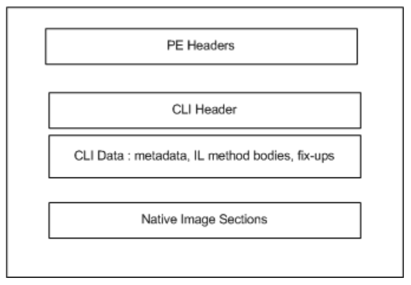

.NET Assembly File Format
=========================

The .NET platform defines a binary file format - "assembly" - that is used to fully-describe and contain .NET programs. Assemblies are used for the programs themselves as well as any dependent libraries. A .NET program can be executed as one of more assemblies, with no other required artifacts, beyond the appropriate .NET runtime. Native dependencies, including operating system APIs, are a separate concern and are not contained within the .NET assembly format, although are sometimes described with this format (e.g. WinRT).

> Each CLI component carries the metadata for declarations, implementations, and references specific to that component. Therefore, the component-specific metadata is referred to as component metadata, and the resulting component is said to be self-describing -- from ECMA 335 I.9.1, Components and assemblies.

The format is fully specified and standardized as [ECMA 335](dotnet-standards.md). All .NET compilers and runtimes use this format. The presense of a documented and infrequently updated binary format has been a major benefit (arguably a requirement) for interoperatibility. The format was last updated in a substantive way in 2005 (.NET 2.0) to accomodate generics and processor architecture.

The format is CPU- and OS-agnostic. It has been used as part of .NET runtimes that target many chips and CPUs. While the format itself has Windows heritage, it is implementable on any operating system. It's arguably most significant choice for OS interopertability is that most values are stored in little-endian format. It doesn't have a specific affinity to machine pointer size (e.g. 32-bit, 64-bit).

The .NET assembly format is also very descriptive about the structure of a given program or library. It describes the internal components of an assembly, specifically: assembly references and types defined and their internal structure. Tools or APIs can read and process this information for display or to make programmatic decisions.

Format
======

The .NET binary format is based on the Windows [PE file](http://en.wikipedia.org/wiki/Portable_Executable) format. In fact, .NET class libraries are conformant Windows PEs, and appear on first glance to be Windows dynamic link libraries (DLLs) or application executables (EXEs). This is a very useful characteristic on Windows, where they can masquerade as native executable binaries and get some of the same treatment (e.g. OS load, PE tools). 

Assemblies headers from ECMA 335 II.25.1, Structure of the runtime file format.

Processing the Assemblies
=========================

It is possible to write tools or APIs to process assemblies. Assembly information enables making programmatic decisions at runtime, re-writing assemblies, providing API intellisense in an editor and generating documentation. [System.Reflection](https://msdn.microsoft.com/library/system.reflection.aspx) and [Mono.Cecil](http://www.mono-project.com/docs/tools+libraries/libraries/Mono.Cecil/) are good examples of tools that are frequently used for this purpose.