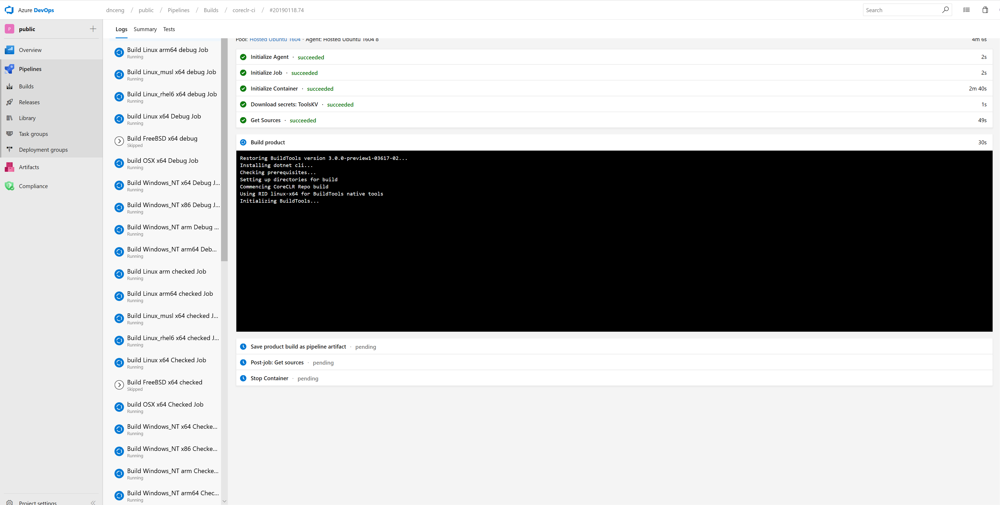

Testing with Azure DevOps
===

We enabled Azure DevOps for pull request validation. You can now see the new "badge" **coreclr-ci** that was added on a pull request page.

We disabled default triggering for the following innerloop jobs in Jenkins:

* Ubuntu arm Cross Checked Innerloop Build and Test
* Ubuntu arm Cross Checked no_tiered_compilation_innerloop Build and Test
* Ubuntu16.04 arm64 Cross Checked Innerloop Build and Test 
* Ubuntu16.04 arm64 Cross Checked no_tiered_compilation_innerloop Build and Test
* Windows_NT arm Cross Debug Innerloop Build
* Windows_NT arm Cross Checked Innerloop Build and Test
* Windows_NT arm64 Cross Debug Innerloop Build
* Windows_NT arm64 Cross Checked Innerloop Build and Test

since they are using limited hardware.

The results for those jobs can be found in the new CI system. 
Other Jenkins jobs are running as usual and we will continue monitoring them to validate consistency between Jenkins and AzDev test jobs.

# How to find the test results in Azure DevOps?

If you click on coreclr-ci Details link 

this would take you to [Azure DevOps Portal](https://dev.azure.com/dnceng/public/_build?definitionId=228) for dotnet/coreclr repo where you can see on the left Build and Test jobs that were triggered.

You can select a job and see what step it is currently running.

All the test jobs have **"Send tests to Helix"** step which uploads product binaries and test artifacts to Helix machines for running the tests concurrently and waits for them to finish.

If all tests are passed the step icon turns green. 

If there are any failed tests the icon goes red. To see what tests have failed you need to click on the step link

and then click on 

> Results will be available from https://mc.dot.net/#/user/coreclr-pulls/pr~2Fdotnet~2Fcoreclr~2Frefs~2Fpull~2F22051~2Fmerge/test~2Ffunctional~2Fcli~2Fpri0/20190117.72

which would take you to (Mission Control)[https://mc.dot.net/#/user/coreclr-pulls/pr~2Fdotnet~2Fcoreclr~2Frefs~2Fpull~2F22051~2Fmerge/test~2Ffunctional~2Fcli~2Fpri0/20190117.72]

You will see the matrix of test results where columns correspond to combinations of different operating systems and architectures (e.g., Fedora.28.Amd64.Open-x64, Windows.10.Amd64.Open-x86) while rows correspond to different collections of tests (e.g.,  JIT.Performance, GC.Regressions).

If there are failing tests the will appear at the bottom 

